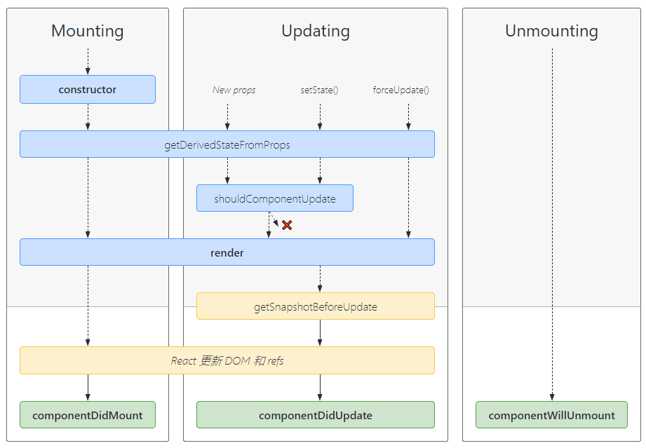

## react文件结构

react文件就是`js`文件，每一个文件都可以称为一个`组件`，分为`函数式`和`类式`组件。编写组件的语法称为`jsx`，它是一种`JavaScript`的语法扩展。

### 函数式组件说明
```jsx
function App() {
  return (
    <div>hello word</div>
  );
}

export default App;
```
大体上分为两个部分，函数体部分本质上就是`js`代码，中间的模板部分就是单纯的`HTML`。

### 类式组件说明

```jsx
import React, { Component } from 'react';

class App extends Component {
  constructor(props) {
    super(props)
  }
  render () {
    return (
      <div>hello word</div>
    );
  }
};

export default App;
```
和函数式组件类似，类式组件依托于`es6`中的`class`的概念，最后也会返回模板部分的`HTML`。

### 组件形式的分析
函数式组件就是一个纯函数。在参数一致的情况下，总是有一致的处理结果。最大的优势胜在编写灵活，能最大的限度满足业务的需求。性能方面，因为不需要创建react实例，相应的执行效率会高一些。但相应的，函数式组件中不存在状态管理和生命周期的概念，所以功能上有所欠缺。

类式组件作为官方推荐的全功能创建组件的方式，其功能是完整的。其中的状态管理和生命周期都是研发中必不可少的重要功能。对于经验丰富的开发人员来说，他们可以正确的选择合适的组件创建方式来进行研发，而对于我们这种经验并不丰富的开发人员来说，使用类式组件是一个不容易出错的选择。

### 生命周期

